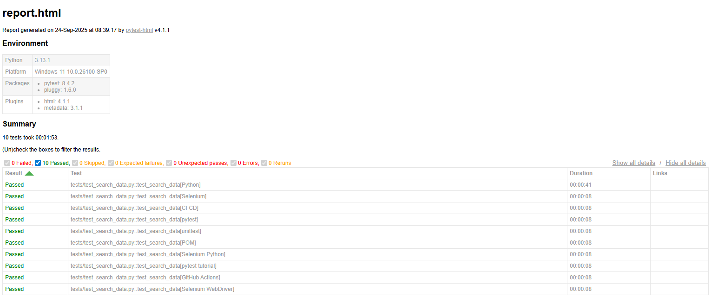

# Python Selenium Portfolio: テスト自動化 & CI/CD

このリポジトリは、**Python と Selenium を活用したテスト自動化のベストプラクティス**を実装したポートフォリオです。  
CI/CD環境を構築し、以下のスキルセットを実証しています：

- Page Object Model によるテストの保守性向上（Issue #3）
- 外部データ駆動テスト（CSV/Excel/JSON）で複数ケースを効率的にテスト（Issue #5）
- テスト結果の HTML レポート化と GitHub Actions による自動実行・アーティファクト保存（Issue #7）

※当初 Google 検索での自動化を試みましたが、reCAPTCHA による制約があり、最終的には **自作HTMLで検索テスト** を行っています。

---

## 使用技術
- Python 3.13
- Selenium
- pytest
- pytest-html
- webdriver-manager
- GitHub Actions（CI/CD）
- Page Object Model（テスト設計パターン）

---

## 環境構築

1. リポジトリをクローン
```bash
git clone https://github.com/TechCat-Hello/python-selenium-portfolio.git
cd python-selenium-portfolio
```

2. 仮想環境を作成・有効化
```bash
python -m venv .venv
.venv\Scripts\activate   # Windows
source .venv/bin/activate   # Linux/Mac
```
3. 依存関係をインストール 
```
pip install -r requirements.txt
```

## テストの実行方法
ローカル環境で自作HTML検索テストを実行：
```bash
pytest --html=reports/report.html --self-contained-html
```

- レポートは reports/report.html に出力されます。
- ブラウザでレポートを確認可能です。

## GitHub Actions CI
- ブランチに push すると自動でテストが実行されます。
- HTMLレポートはアーティファクトとして保存されます。

## 実施済み Issue / PR
### Issue #3: POMによる検索テストリファクタリング
テストの保守性向上、Page Object Modelの使用

### Issue #5: 外部データ駆動テスト
CSV/Excel/JSONで複数ケースのテストを実施

### Issue #7: テスト結果HTML化 & GitHub Actions自動実行
CI/CD、HTMLレポートの生成とアーティファクト保存を確認

## スクリーンショット

### 1. GitHub Actions 成功画面


### 2. HTMLレポートのブラウザ表示 (GitHub Actions Ubuntu環境で自動作成)


### 3. HTMLレポート概要（ローカル）


### 4. 自作HTML検索テスト（ローカル）


## License

This project is licensed under the MIT License. See the [LICENSE](LICENSE) file for details.

## 📮 Author
TechCat  
GitHub: https://github.com/TechCat-Hello